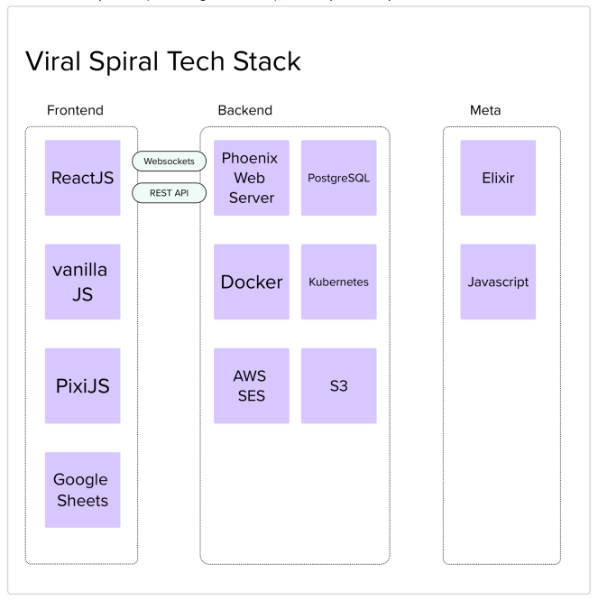

# Architecture

> Show me your flowchart and conceal your tables, and I shall continue to be mystified. Show me your tables, and I won't usually need your flowchart; it'll be obvious. - Fred Brook

There are a few data structures in Viral Spiral. All actions and effects happen by transforming them. Let start with them and rest will folow.

<details>
    <summary> Game State </summary>
    ```elixir
        state = %State{
          room: %Room{
            id: "room_abc",
            name: "crazy-house-3213",
            state: :running,
            unjoined_players: [],
            affinities: [:skub, :houseboat],
            communities: [:red, :yellow, :blue],
            chaos: 0,
            chaos_counter: 10,
            volatality: :medium
          },
          players: %{
            "player_abc" => %Player{
              id: "player_abc",
              name: "farah",
              biases: %{yellow: 0, blue: 0},
              affinities: %{skub: 0, houseboat: 0},
              clout: 0,
              identity: :red,
              hand: [],
              active_cards: []
            },
            "player_def" => %Player{
              id: "player_def",
              name: "aman",
              biases: %{red: 0, blue: 0},
              affinities: %{skub: 0, houseboat: 0},
              clout: 0,
              identity: :yellow,
              hand: [],
              active_cards: []
            },
            "player_ghi" => %Player{
              id: "player_ghi",
              name: "krys",
              biases: %{yellow: 0, blue: 0},
              affinities: %{skub: 0, houseboat: 0},
              clout: 0,
              identity: :red,
              hand: [],
              active_cards: []
            },
            "player_jkl" => %Player{
              id: "player_jkl",
              biases: %{yellow: 0, blue: 0},
              affinities: %{skub: 0, houseboat: 0},
              clout: 0,
              name: "adhiraj",
              identity: :red,
              hand: [],
              active_cards: []
            }
          },
          round: %Round{
            order: ["player_jkl", "player_ghi", "player_def", "player_abc"],
            count: 4,
            current: 0,
            skip: nil
          },
          turn: %Turn{
            current: "player_ghi",
            pass_to: ["player_def"],
            path: ["player_abc", "player_jkl"]
          }
        }
    ```
</details>

# Tech Stack


# Architecture

Each Game Room should be a dynamically supervised GenServer.
So any crashes in one room should be isolated.


# Should all structs be colocated under a Room struct or no?
Colocation makes it easy for developers to see everything in a struct but are the added memory requirements worth it-


# Changes
type : can be any atom

Reserved atoms :
- :ignore : when you want to skip making any changes.

